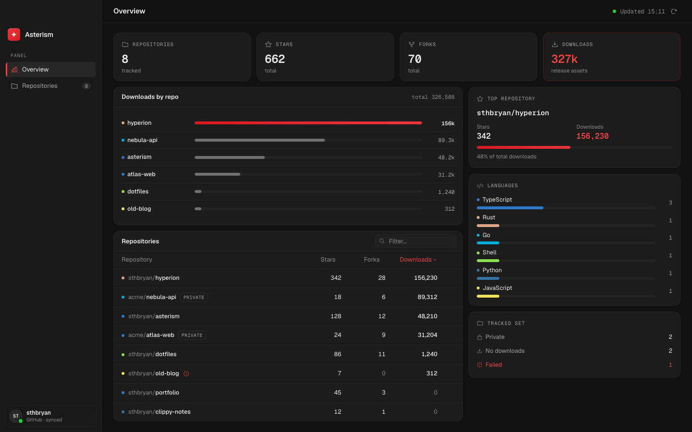
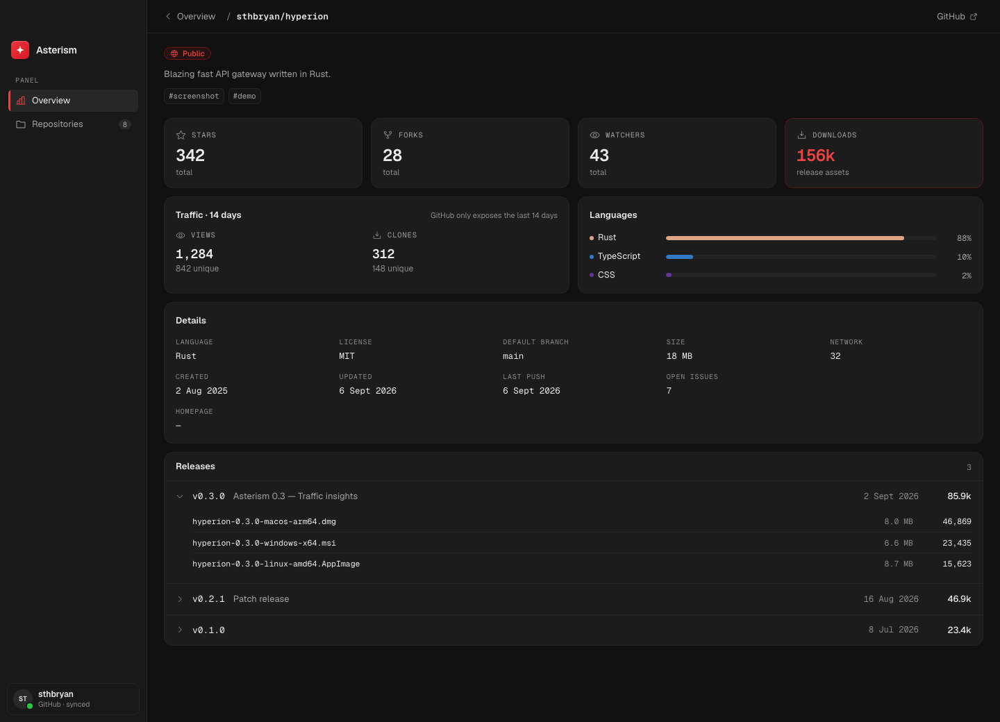
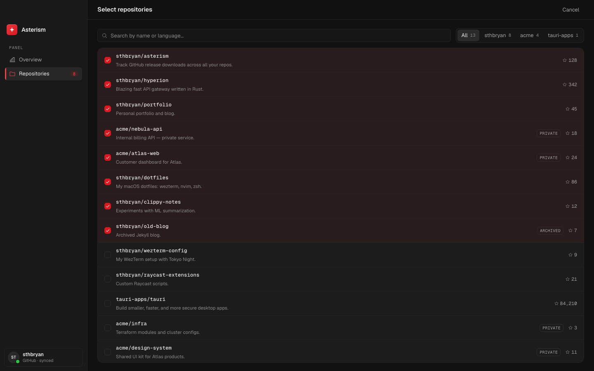

<h1 align="center">Asterism</h1>

<p align="center">
  
</p>

<p align="center">
  <strong>GitHub stats for the repos you actually track.</strong>
</p>

<p align="center">
  Stars, forks, and release downloads for a set you pick.<br />
  Asterism talks to GitHub through <code>gh</code>.<br />
  Nothing is tracked until you mark it.
</p>

<p align="center">
  <a href="https://github.com/sthbryan/Asterism/releases">Download</a>
  ·
  <a href="#get-it">Install</a>
</p>

---

Asterism does not list every repository you own. You choose the set, the selection is saved locally for each GitHub account, and the window shows stars, forks, and download totals for that set. Open a repo and you get traffic, languages, each release, and each asset.

It uses the GitHub CLI you already signed in with. Saved data opens before connecting, even when `gh` is missing or not authenticated. Use **Check connection** to retry without restarting. Network failures show connection details instead of claiming the CLI is missing.

---

## Screenshots





---

## What it actually does

**Only the repos you mark**  
The picker lists your user and org repositories. Toggles persist. Unmarked repos stay out of the way.

**List first, detail when you need it**  
Overview: stars, forks, total release downloads. Detail: watchers, issues, last push, 14-day views and clones, languages, and every release with per-asset counts.

**Create repositories**

The Create repository tab supports personal or organization ownership, private/public visibility, a README, a gitignore template, and a license. New repositories are private by default. Choose whether to track them immediately. Organization policies and account permissions still apply.

**`gh` is the client**  
No extra GitHub token in the app. Asterism shells out to `gh` with the account already configured on the machine.

**Local data and offline mode**

Asterism uses Tauri Plugin Store in the OS application-data directory. Settings shows the exact location. Preferences, projects, cached repository data, and snapshots are separate. Cache is isolated by GitHub host and account; authentication stays with `gh`.

Previously fetched summaries, the catalog, and opened details can be read offline. Creating repositories requires a live connection; actions are never queued. Failed refreshes keep the last valid response and its date. Traffic is only the latest GitHub response, with its original 14-day period, not an accumulated visits/clones history.

Cache is limited to 100 details and 16 MiB per account. Star/download/fork history retains up to 180 observations per series for 500 repositories. **Clear repository cache** in Settings keeps preferences, projects, and history. Local storage is not a remote backup: deleting app data removes it.

On upgrade, the old `~/.config/asterism/config.json` and `~/.cache/asterism/{cache,history}.json` files are migrated without deleting the originals. They do not identify a GitHub account, so Settings lets you view them separately or explicitly import them into the connected account. Existing account data takes precedence.

---

## Built for

- People who ship releases and want download counts without opening every GitHub page
- A small set of repos that matter, not a dump of everything you fork
- Anyone already living in `gh` who wants a desktop view of the same data

---

## Get it

**From source**

```bash
bun install
bun run tauri dev
```

| | |
|---|---|
| **Download** | [GitHub Releases](https://github.com/sthbryan/Asterism/releases) |
| **From source** | `bun install`, then `bun run tauri dev` |
| **Icons** | `bun run icons` |

To fetch new data or create repositories, Asterism needs [GitHub CLI](https://cli.github.com) (`gh`) installed and signed in (`gh auth login`). It does not replace `gh`. It reads through it.

---

## Architecture

- `src-tauri`: Tauri v2 host. Detects `gh`, loads config, fetches catalog, tracked stats, and repo detail off the UI thread.
- `src`: React client. Overview, repo picker, and detail.
- Tauri app data: versioned Plugin Store documents for preferences, projects, account caches, and bounded history.
- Tests: `bun test tests` and `cargo test --manifest-path src-tauri/Cargo.toml`.

`gh` owns auth and the GitHub API. The app is a thin desktop client over that CLI.

---

<p align="center">
  <sub>MIT License</sub>
</p>
